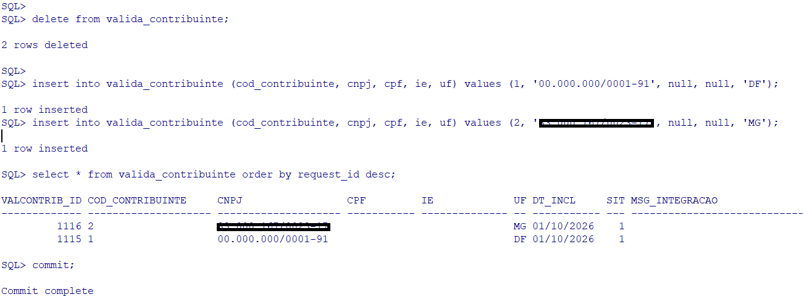
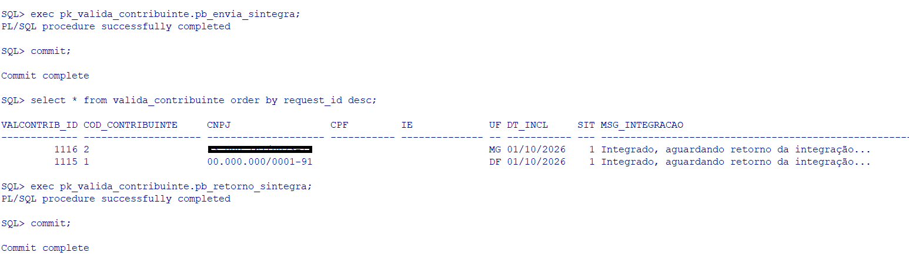
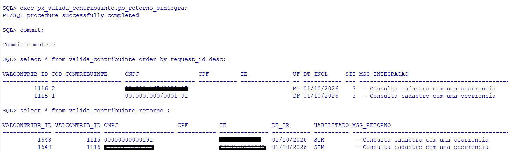

# Integração da API SINTEGRA com Oracle PL/SQL – Consulta de Inscrição Estadual em tempo real

Exemplo de integração da **API SINTEGRA da ArquivoNfe** utilizando Oracle PL/SQL e os recursos `APEX_WEB_SERVICE` e `APEX_JSON`.

O projeto demonstra como realizar consultas de dados cadastrais de contribuintes por UF, utilizando **CNPJ, CPF ou Inscrição Estadual (IE)**, conforme a disponibilidade da consulta para cada UF.

A integração utiliza processamento assíncrono por meio do `request_id`, permitindo enviar as solicitações e consultar seus respectivos resultados posteriormente.

## 🔎 Palavras-chave

* API SINTEGRA Oracle
* Oracle PL/SQL
* Oracle APEX
* Consulta SINTEGRA
* SINTEGRA CCC
* Consulta Inscrição Estadual
* API Fiscal Brasil
* Integração Oracle com API REST
* Consulta CNPJ
* Consulta CPF

## Benefícios

* Consulta por CNPJ, CPF ou IE
* Integração com Oracle PL/SQL
* Comunicação com API REST via HTTPS
* Processamento assíncrono utilizando `request_id`
* Armazenamento dos resultados em tabelas Oracle
* Exemplo prático de integração com Oracle APEX

## Casos de uso

* Validação cadastral antes da emissão de NF
* Conferência cadastral automática
* Verificação de informações de empresas e contribuintes
* Integração com sistemas ERP e aplicações próprias
* Automatização de processos fiscais

## Diferenciais

* Consulta dos dados cadastrais disponibilizados pela SEFAZ da UF consultada.
* Comunicação segura por HTTPS.
* Infraestrutura hospedada na Oracle Cloud no Brasil.
* API REST com suporte a consultas por CNPJ, CPF ou Inscrição Estadual.
* Exemplo de integração utilizando recursos nativos do Oracle APEX.

---

## 📋 Requisitos

* Oracle Database com suporte a PL/SQL
* Oracle APEX, para utilização de `APEX_WEB_SERVICE` e `APEX_JSON`
* Acesso HTTPS ao endpoint da API
* Token de autenticação da ArquivoNfe

---

## 📁 Arquivos do projeto

| Arquivo                      | Descrição                                                        |
| ---------------------------- | ---------------------------------------------------------------- |
| `tabelas.sql`                | Criação das tabelas, sequences, constraints e registros de teste |
| `PK_VALIDA_CONTRIBUINTE.pck` | Package PL/SQL responsável pela integração com a API             |
| `sintegra.png`               | Imagem ilustrativa                                               |
| `teste_etapa1.png`           | Exemplo da primeira etapa da integração                          |
| `teste_etapa2.png`           | Exemplo da segunda etapa                                         |
| `teste_etapa3.png`           | Exemplo da terceira etapa                                        |

---

## 🚀 Como utilizar

### 1️⃣ Cadastre-se gratuitamente

Acesse o portal:

https://portal.arquivo-nfe.com

Crie sua conta para obter acesso à API.

---

### 2️⃣ Copie seu Token

Após o login no portal:

1. Acesse o menu **Meu Token**.
2. Copie seu token de acesso.

> ⚠️ Nunca publique seu token de acesso no GitHub.

No package `PK_VALIDA_CONTRIBUINTE.pck`, localize a variável:

```sql
gv_token := 'SEU_TOKEN_AQUI';
```

Informe seu token apenas no ambiente local.

---

### 3️⃣ Crie as tabelas

Execute o script `tabelas.sql` no schema Oracle que será utilizado para a integração.

O script cria:

* Tabela `VALIDA_CONTRIBUINTE`: armazena as solicitações de consulta.
* Tabela `VALIDA_CONTRIBUINTE_RETORNO`: armazena os dados retornados pela API.
* Sequences para geração dos identificadores.
* Constraints e índice para relacionamento entre as tabelas.
* Registros de exemplo para teste.

---

### 4️⃣ Configure o package

Abra o arquivo `PK_VALIDA_CONTRIBUINTE.pck` e configure o token de acesso.

O package utiliza os recursos:

* `APEX_WEB_SERVICE`: envio das requisições HTTP.
* `APEX_JSON`: leitura e interpretação das respostas JSON.
* `DBMS_LOCK.SLEEP`: intervalo entre tentativas de consulta.

O schema precisa possuir os privilégios necessários para utilização desses recursos e acesso HTTPS ao endpoint da API.

---

### 5️⃣ Execute a integração

O package disponibiliza duas procedures principais:

#### `PB_ENVIA_SINTEGRA`

Responsável por enviar as consultas pendentes à API, utilizando CNPJ, CPF ou IE e armazenando o `request_id` retornado.

#### `PB_RETORNO_SINTEGRA`

Responsável por consultar os resultados das solicitações enviadas anteriormente e armazenar os dados cadastrais retornados.

A separação em duas etapas permite organizar o envio das solicitações e o processamento dos respectivos retornos.

---

## 🔄 Execução dos processos

As procedures de integração podem ser executadas de diferentes formas, de acordo com a arquitetura do sistema que estiver utilizando a API.

Por exemplo:

* por meio de um **JOB do Oracle**;
* por um **scheduler** da aplicação;
* diretamente por uma aplicação ou sistema ERP;
* manualmente, durante testes ou processos específicos.

Não é necessário manter as procedures em execução continuamente.

O cliente pode definir a frequência e a forma de execução de acordo com sua necessidade.

Por exemplo, uma implementação pode executar periodicamente:

```sql
BEGIN
    pk_valida_contribuinte.pb_envia_sintegra;
    pk_valida_contribuinte.pb_retorno_sintegra;
END;
/
```

Outra implementação pode separar as duas etapas em processos diferentes, inclusive utilizando horários ou JOBs distintos.

---

## 💾 Controle de transação

O exemplo utiliza operações de `INSERT`, `UPDATE` e demais operações necessárias para controlar o processo de integração.

O **controle da transação (`COMMIT` ou `ROLLBACK`) deve ser definido pelo usuário de acordo com a estrutura e a arquitetura de seu processo de integração**.

Dessa forma, o exemplo não pressupõe que o cliente utilizará uma estratégia específica de controle transacional.

Por exemplo, a aplicação pode optar por:

* realizar `COMMIT` após concluir cada etapa;
* realizar `COMMIT` após um determinado lote;
* controlar o `COMMIT` externamente à package;
* utilizar `ROLLBACK` em caso de falha do processo.

Essa decisão depende do modelo de processamento adotado pelo sistema que está utilizando a integração.

---

## 🔢 Limite de tentativas

Durante o processo de consulta dos resultados, o exemplo possui um limite de **2.000 tentativas de chamada** à API para o processamento dos registros.

Esse limite evita que um processo permaneça executando indefinidamente em situações nas quais determinados registros não estejam disponíveis para retorno.

Os registros que eventualmente **não forem integrados dentro do processamento atual permanecem disponíveis para uma próxima execução**, de acordo com as regras implementadas no processo do cliente.

Dessa forma, o processo pode ser executado novamente, permitindo que as solicitações pendentes sejam tratadas posteriormente.

O número de tentativas e os critérios de processamento podem ser adaptados pelo usuário conforme sua necessidade e arquitetura.

---

## 📊 Consulte os resultados

Os registros de integração são armazenados nas tabelas:

```sql
SELECT *
FROM VALIDA_CONTRIBUINTE;
```

```sql
SELECT *
FROM VALIDA_CONTRIBUINTE_RETORNO;
```

A situação da solicitação é controlada pelo campo `SIT`:

| SIT | Descrição           |
| --- | ------------------- |
| 1   | Pendente            |
| 2   | Processado com erro |
| 3   | Processado          |

---

## 🔄 Fluxo da integração

O processo é dividido em duas etapas principais.

### 1. Envio das consultas

Os contribuintes são incluídos na tabela `VALIDA_CONTRIBUINTE`.

A procedure `PB_ENVIA_SINTEGRA` envia as solicitações para a API e recebe um `request_id` para cada consulta aceita.

### 2. Consulta dos resultados

A procedure `PB_RETORNO_SINTEGRA` utiliza o `request_id` para consultar posteriormente o resultado da solicitação.

Quando o resultado está disponível, os dados cadastrais são armazenados na tabela `VALIDA_CONTRIBUINTE_RETORNO`.

### Fluxo resumido

```text
VALIDA_CONTRIBUINTE
        │
        ▼
PB_ENVIA_SINTEGRA
        │
        ▼
      API
        │
        ▼
   request_id
        │
        ▼
PB_RETORNO_SINTEGRA
        │
        ▼
VALIDA_CONTRIBUINTE_RETORNO
```

A arquitetura assíncrona permite separar o envio das solicitações da obtenção dos resultados.

---

## 🧪 Exemplos de execução

### Etapa 1 — Envio das consultas



### Etapa 2 — Consulta dos retornos



### Etapa 3 — Dados armazenados



---

## 📚 Documentação da API

Consulte a documentação completa da API SINTEGRA:

https://www.arquivo-nfe.com/api-sintegra-ccc

---

## ⭐ Apoie o projeto

Se este projeto foi útil para você:

⭐ **Deixe uma estrela no repositório.**

Isso ajuda outras pessoas a encontrarem este exemplo de integração.

---

Made with ❤️ by **ArquivoNfe**

https://www.arquivo-nfe.com
